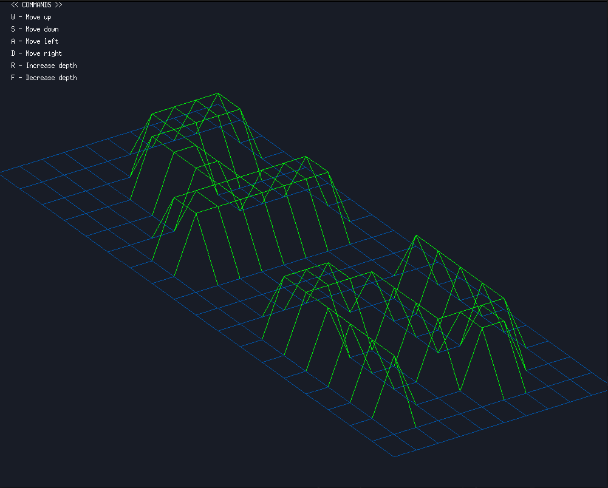

# FdF: Wireframe Representation of 3D Maps

## Overview

`FdF` is a project that visualizes 3D maps in a 2D isometric view using the MiniLibX graphics library. This program reads a file containing height values of a grid and then renders a wireframe of the terrain using line drawing and simple transformations. The program allows interaction with the rendered map for navigation, zooming, and changing perspectives.

## Functionality

The main features of `FdF` include:
- **Reading and Parsing Map Data**: The program reads height values from a file specified as a command line argument. It processes these values into a 2D array to represent the terrain.
- **Isometric Rendering**: The height values are projected onto a 2D plane to give a 3D isometric view of the terrain.
- **User Interaction**: The user can interact with the visualized map, including moving, zooming, and changing the projection view.

### Key Components

- **`get_map()`**: Reads the height data from a file, parses it into integers, and stores it in a 2D array.
- **`draw_map()`**: Draws the entire map onto the window using the projected height values and colors based on elevation.
- **Interaction Functions**:
  - **`command_pressed()`**: Handles keyboard input to control the movement, zoom, depth, and rotation of the rendered map.
  - **`zoom_handler()`**: Applies zoom transformation to coordinates and adjusts the depth.
  - **`put_pixel()`**: Plots individual pixels onto the screen buffer.
  - **`draw_line()`** and **`trace_line()`**: Implements line drawing between grid points based on the height data.
  - **`show_commands()`**: Displays instructions for user interaction in the window.

### Example Usage

Compile the project using the provided Makefile, and run the program with a map file:

```sh
make
./fdf <path_to_map_file>
```

Example:

```sh
./fdf maps/42.fdf
```

This command will open a window and display the isometric view of the map defined in `maps/42.fdf`.

Example: 


### User Controls

- **W/S**: Move up/down
- **A/D**: Move left/right
- **R/F**: Increase/decrease depth
- **E/Q**: Increase/decrease zoom
- **Left Arrow/Right Arrow**: Rotate left/right
- **ESC**: Close the window and exit the program

### Compilation

Use the provided `Makefile` to compile the project. Make sure that you have MiniLibX installed for Linux or macOS.

```sh
make
```

This command will generate the executable `fdf`. You can then run it with a map file to visualize the 3D representation.

### How It Works

- **Rendering**: The program uses the `mlx` library to open a graphical window and draw the map. Height values are multiplied by a zoom factor and adjusted for perspective to create a visually appealing isometric view.
- **Line Drawing Algorithm**: The program draws lines between points using a simple line-drawing algorithm to connect the different grid points based on their height values.
- **Color Gradient**: The height of each point is used to determine its color, creating a gradient that visually represents different elevations.

### Example Map File

The input map file should be a text file where each line represents a row of the grid, and each value represents the height at that point. Example format:

```
0 0 0 0 0 0 0
0 10 10 10 0 0 0
0 10 20 10 0 0 0
0 0 0 0 0 0 0
```

This represents a simple terrain with different height values.

## Limitations

- **Limited Map Size**: The current implementation might struggle with very large maps due to memory and rendering constraints.
- **Isometric Only**: Currently, only isometric projection is supported, with an option to switch between isometric and cabinet, but no full 3D rotation.

## Bonus Features

The bonus version of `FdF` includes additional features that enhance user interaction and visualization:
- **Cabinet Projection**: In addition to the isometric projection, the user can switch to cabinet projection for a different perspective view of the map. This allows better visualization for certain types of terrains.
- **Rotation**: The map can be rotated left or right using the arrow keys, allowing the user to view the terrain from different angles and understand its 3D structure better.
- **Background Drawing**: The program can now redraw the background before rendering the terrain, which helps maintain a clean visual state during transformations and movements.
- **Enhanced User Controls**: The bonus version introduces more user-friendly commands, such as toggling between different projections and finer control over depth and zoom, making the experience more interactive.

## Possible Improvements

- **Better shortcuts**: I could add the possibility to close the program by clicking on the cross (atm "escape" needed)

## Conclusion

`FdF` is a project designed to help understand fundamental computer graphics concepts such as 3D projection, line drawing, and user interaction within a graphics window. It showcases how to convert raw data into an interactive visual representation and is an excellent way to learn low-level graphics programming in C.


